# Termplex: tmux Orchestration Core

[](https://github.com/owen-6936/termplex/actions/workflows/ci.yml)
[](https://goreportcard.com/report/github.com/owen-6936/termplex)
[](https://godoc.org/github.com/owen-6936/termplex)
[](https://opensource.org/licenses/MIT)

**Termplex** is a Go-based terminal orchestration engine for managing multiplexed, process-aware terminal environments. It provides clean, testable primitives for creating, interacting with, and terminating shell sessions.

---

## 🧠 Philosophy

- **Layered Architecture**: A generic orchestration engine (`session`, `window`, `pane`, `shell`) provides the core logic, while specific backends (like `tmux`) implement the details.
- **Clarity-first abstraction**: Wraps raw `tmux` commands with minimal, intention-revealing helpers
- **Process introspection**: Query pane state, working directories, and buffer contents with precision
- **Composable primitives**: Built for integration with Termplex’s session manager, changelog engine, and contributor overlays
- **CI-safe and testable**: Supports detached sessions, shell seeding, and robust guards for non-interactive environments

---

## 🏛️ Core Architecture

| Package         | Role                                                                                             |
|-----------------|--------------------------------------------------------------------------------------------------|
| `window`        | Manages a collection of panes, representing a logical workspace.                                 |
| `pane`          | Manages a single view that can contain one interactive shell and multiple background processes.    |
| `shell`         | Provides low-level, stateless utilities for spawning, interacting with, and terminating OS processes (`exec.Cmd`). |
| `tmux`          | Provides a specific backend for orchestrating shells within a real `tmux` server environment.      |

This design separates the "what" (the state of windows and panes) from the "how" (the underlying process management), allowing for flexible and testable orchestration.



---

## 🚀 Getting Started

To see the generic orchestration engine in action, you can run the main demonstration file:

```bash
go run ./main.go
```

Import it in your Go project:

```go
import "github.com/nexicore/termplex/tmux"
```

---

## 🔧 Core Primitives

| Function                      | Purpose                                      |
|------------------------------|----------------------------------------------|
| `RunTmux(args ...string)`    | Execute raw tmux commands                    |
| `NewSession(name string)`    | Create a detached tmux session               |
| `NewWindow(session string)`  | Add a window to an existing session          |
| `SendKeys(target string, cmd string)` | Send keystrokes to a target pane     |
| `GetPanePath(target string)` | Query the working directory of a pane        |
| `CapturePane(target string)` | Capture the visible buffer of a pane         |
| `StartShell(target string, path string)` | Seed a shell in a target pane     |

---

## 🧪 Test Strategy

- Detached sessions with seeded shells for reproducibility
- CI-safe guards for interactive and non-interactive workflows
- Functional changelogs for exported primitives and orchestration events

---

## 📚 License

MIT © 2025 Georgiy Komarov & Nexicore Digitals
