# Visual Glossary: The `tmux` Hierarchy

This document explains the core concepts of the `tmux` object model. Understanding this hierarchy is essential for working with the `termplex` `tmux` backend.

`tmux` operates on a client-server model. All sessions, windows, and panes are managed by a single `tmux` server process running in the background.

## The Hierarchy

---

### Definitions

* **Session**: A session is a collection of one or more windows. You can detach from a session and re-attach to it later; all the windows, panes, and processes inside it will continue to run. This is the top-level workspace managed by `termplex`'s `tmux` backend.

* **Window**: A window occupies the entire screen and can be thought of as a single "tab" within a session. Each window has a unique index (e.g., `0`, `1`, `2`).

* **Pane**: A pane is a rectangular region within a window where a specific shell process runs. A single window can be split into multiple panes, either horizontally or vertically. Each pane has a unique index within its window (e.g., `0`, `1`, `2`).

* **Process**: Each pane runs a single foreground process, typically an interactive shell like `bash` or `zsh`. All commands sent via `SendKeys` are executed by this process.
